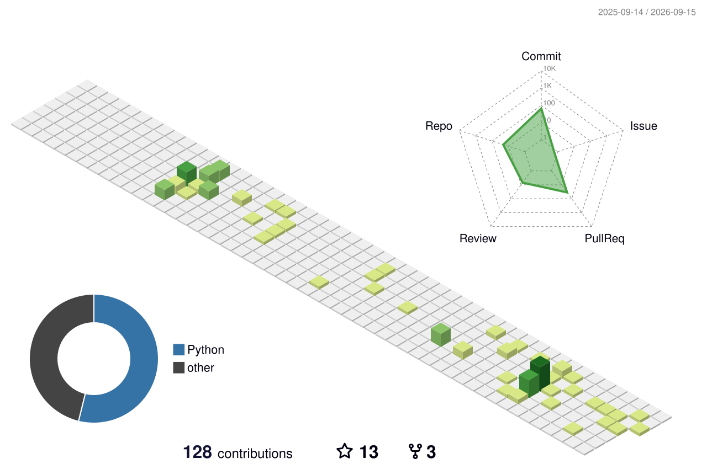

<h1 align="center">Hi 👋, I'm Zuyang Yu</h1>

  

  专注于硬件工程，用 AI 构建智能知识工具 
  Focused on hardware engineering and building intelligent AI-powered tooling.

  
  
  

---

## About Me

- 🔭 Building **Hardware-DataBase** — an intelligent data foundation that brings AI-powered search and understanding to hardware design documents, EDF netlists, and schematics.
- 🧠 Exploring how **AI (embeddings, semantic search, LLM)** can bridge the gap between unstructured hardware knowledge and structured engineering workflows.
- 🛠️ Turning hardware engineering complexity into practical, traceable tools — from circuit design data to team productivity.

## Tech & Focus

  

## Featured Projects

| Project | What it does | Stack / Focus |
| --- | --- | --- |
| [Hardware-DataBase](https://github.com/ZuyangYu/Hardware-DataBase) | Hardware component database and knowledge management system. | Python · CLI · Hardware |

## GitHub Activity

  

<picture>
  <source
    media="(prefers-color-scheme: dark)"
    srcset="https://raw.githubusercontent.com/ZuyangYu/zuyangyu/output/github-contribution-grid-snake-dark.svg"
  />
  <source
    media="(prefers-color-scheme: light)"
    srcset="https://raw.githubusercontent.com/ZuyangYu/zuyangyu/output/github-contribution-grid-snake.svg"
  />
  
</picture>

  <strong>Build with curiosity. Engineer with evidence.</strong> 
  Thanks for visiting — feel free to explore my repositories or get in touch.

  

